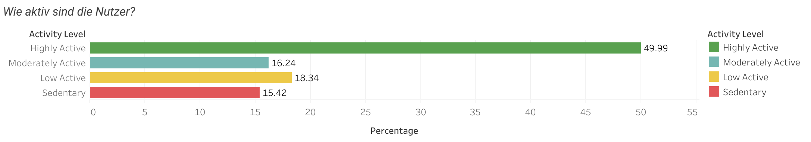
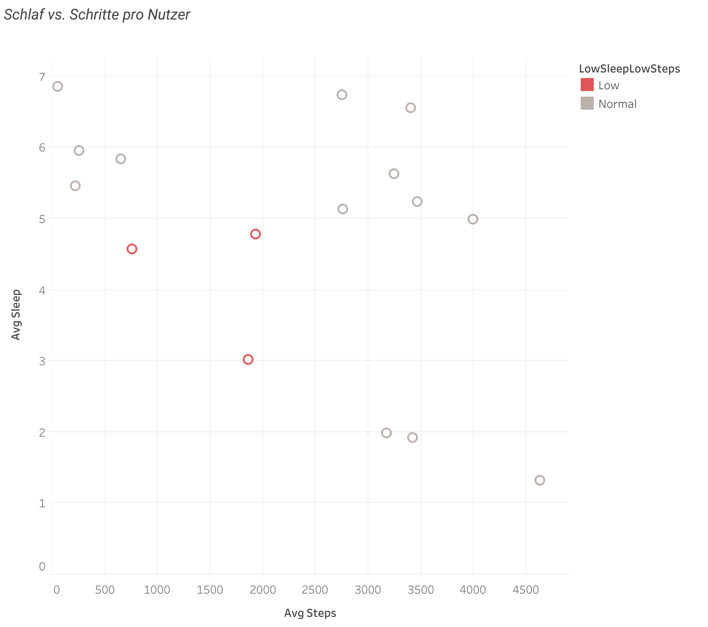
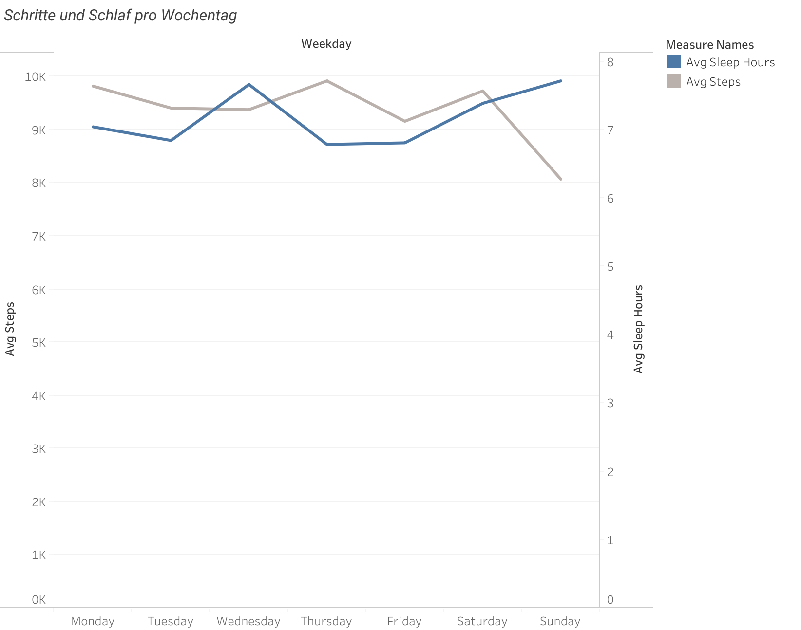
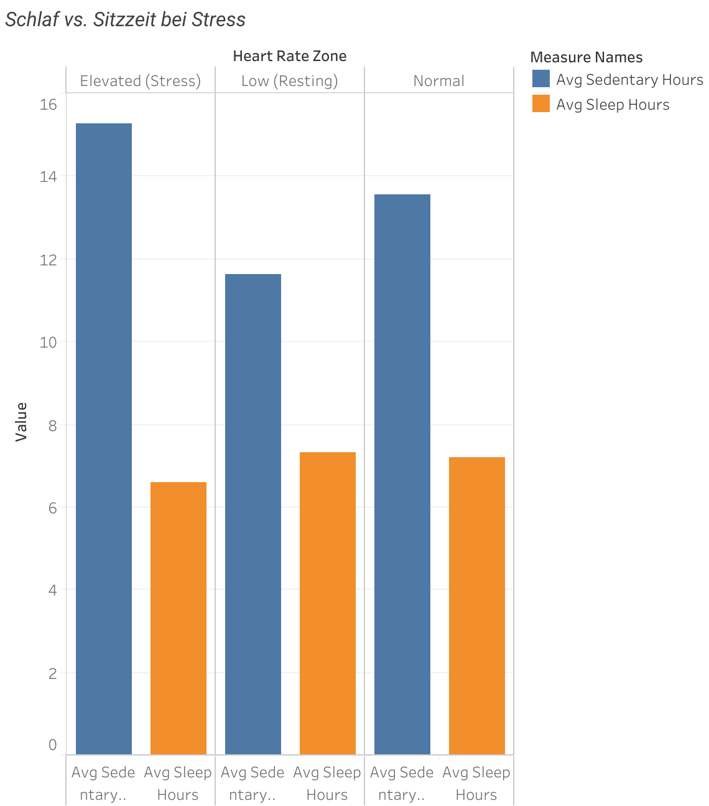
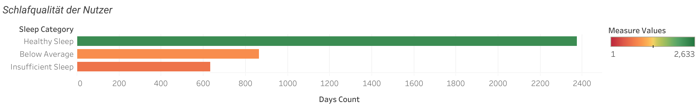

# Phase 5: Visualisierungen & Ergebnisse

## 1.Wie aktiv sind die Nutzer?

 
Analyse:

49,99 % der Nutzer:innen sind "Highly Active"  also sehr aktiv.

Die restlichen Gruppen verteilen sich auf:

Low Active: 18,34 %

Moderately Active: 16,24 %

Sedentary: 15,42 %

Die Mehrheit nutzt Smart Devices aktiv zur Gesundheitsförderung. Dennoch gibt es ein nennenswertes Potenzial zur Aktivierung der weniger aktiven Nutzer:innen.

## 2.Schlaf vs. Schritte pro Nutzer
  
Analyse:

Die meisten Nutzer:innen haben ausgewogenes Schlaf und Bewegungsverhalten.

Einige Nutzer:innen (rot) zeigen niedrige Schlaf und Bewegungswerte, ein Hinweis auf besonders ungesunde Routinen.

## 3.Schritte und Schlaf pro Wochentag

Analyse:

Schritte: Unter der Woche relativ konstant, mit einem kleinen Rückgang am Wochenende (Sonntag niedrigster Wert).

Schlaf: Am Wochenende steigen die Schlafstunden deutlich, Sonntag ist der "Schlaftag".

Nutzer:innen ruhen sich am Wochenende mehr aus, sind aber weniger aktiv. 

## 4. Schlaf vs. Sitzzeit bei Stresslevel (Herzfrequenzzonen)

Analyse:

Nutzer:innen mit "Elevated" Herzfrequenz (Stress) haben die höchste Sitzzeit (~15,5 h) und den niedrigsten Schlaf (~6,7 h).

Die "Normal" und "Resting"Gruppen schlafen mehr und sitzen weniger.

Stress beeinflusst negativ sowohl Schlaf als auch Aktivität.

## 5.Schlafqualität der Nutzer

Analyse:

Die meisten Tage werden als "Healthy Sleep" (über 2.300) kategorisiert.

Rund 850 Tage = Below Average, etwa 650 = Insufficient Sleep.

Während viele Nutzer:innen gut schlafen, gibt es eine große Minderheit mit verbesserungswürdigem Schlaf.

